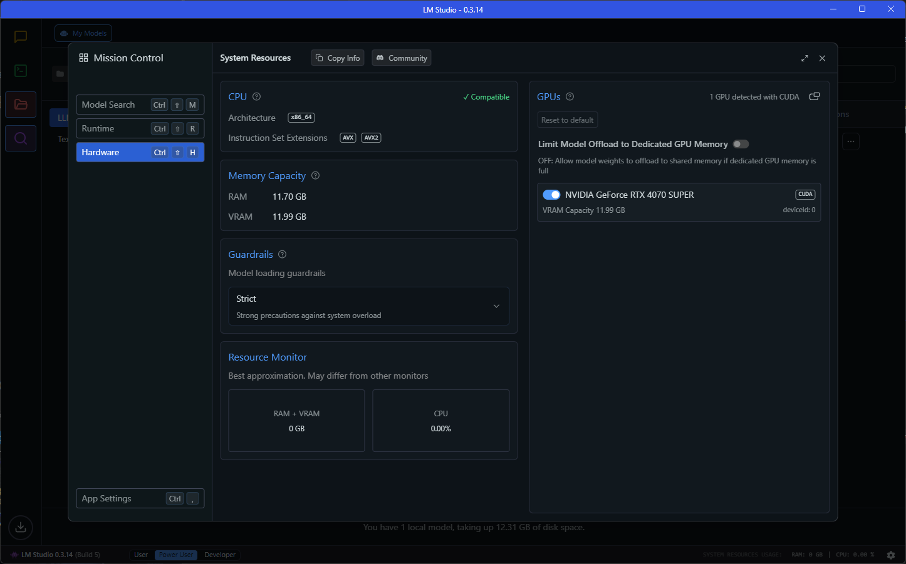
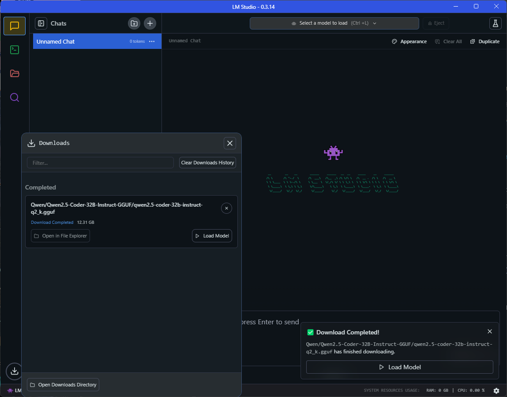
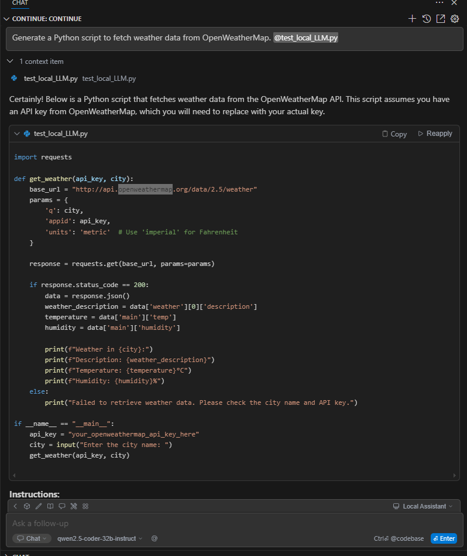
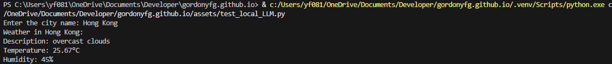

If you've ever wanted the power of an AI coding assistant like ChatGPT or Copilot—but completely offline—this post is for you. In this guide, I'll walk you through how I set up the powerful **Qwen2.5-Coder-32B-Instruct** model locally using **LM Studio**, and how I integrated it into **Visual Studio Code** with the **Continue** extension for a seamless, Copilot-like experience—no subscription or API key needed.

<!--more-->

## Why Run LLMs Locally?

With a powerful setup like the **ROG Ally paired with an RTX 4070 Super eGPU**, I realized I could take full advantage of my hardware to run large language models offline. Running LLMs locally offers several benefits:

- 💡 **No subscription fees**
- 🔐 **Private and secure** (your code and prompts never leave your machine)
- 🚀 **Fast inference with GPU acceleration**
- 💻 **Flexible model swapping** (try different LLMs freely)



## Step 1: Installing LM Studio

[LM Studio](https://lmstudio.ai) is a fantastic tool for downloading and running large language models with minimal setup.

1. **Download LM Studio** from [lmstudio.ai](https://lmstudio.ai) and install it on your Windows system.
2. Launch the app, and in the **Explore** tab, search for:

   ```
   Qwen2.5-Coder-32B-Instruct
   ```

3. Choose a quantization level based on your available VRAM. (For my setup, `Q4` worked well.)
4. After downloading, go to the **Local Server** tab and **start the model**, enabling **GPU Acceleration**.

> 📌 Tip: You can adjust `n_gpu_layers` for performance tuning—start at 10 and increase based on responsiveness.



## Step 2: Installing the Continue Extension in VS Code

The [Continue](https://marketplace.visualstudio.com/items?itemName=Continue.continue) extension brings ChatGPT-style chat into VS Code—perfect for integrating with your locally running LLM.

1. Open VS Code and install the **Continue** extension.
2. After installation, go to your config file:
   ```
   C:\Users\<your_username>\.continue\config.yaml
   ```

3. Update your config with the following:

```yaml
name: Local Assistant
version: 1.0.0
schema: v1

models:
  - name: qwen2.5-coder-32b-instruct
    provider: openai
    model: qwen2.5-coder-32b-instruct
    apiBase: http://localhost:1234/v1
    apiKey: lm-studio
    roles:
      - chat
      - edit
      - apply
    defaultCompletionOptions:
      temperature: 0.2
      topP: 0.9
      maxTokens: 2048
    chatOptions:
      baseSystemMessage: |
        You are an expert AI coding assistant. Help the user with programming questions using clear explanations and clean code.

context:
  - provider: code
  - provider: docs
  - provider: diff
  - provider: terminal
  - provider: problems
  - provider: folder
  - provider: codebase
```

> ⚠️ Double-check that LM Studio’s **local server** is running at `http://localhost:1234/v1`.

## Step 3: Using Qwen2.5 in Your Coding Workflow

Now that everything’s connected, you can open the Continue sidebar (`Ctrl+Shift+P → Continue: Open`) and start chatting with your local AI assistant.

Try prompts like:

- “Generate a Python script to fetch weather data from OpenWeatherMap.”



Result


- “Refactor this function to improve readability.”
- “Explain this segment of C++ code.”

Qwen2.5-Coder-32B-Instruct is tuned for coding tasks, and in my experience, it performs impressively even compared to online services.

## Troubleshooting Tips

- If VS Code says “Unable to connect to model,” ensure LM Studio’s server is running and not blocked by a firewall.
- If you see high RAM/VRAM usage, try a smaller quantization like `Q4` or `Q5`.
- Use `Developer: Toggle Developer Tools` in VS Code to view detailed Continue logs if needed.

## Final Thoughts

By running LLMs like Qwen2.5-Coder-32B-Instruct locally with LM Studio, I’ve unlocked a fully offline, private, and powerful coding assistant. The integration with Continue in VS Code makes it feel as seamless as any commercial Copilot tool—just without the recurring costs.

Whether you're working on embedded systems, web apps, or hobby projects, this setup can supercharge your productivity.

---

Feel free to reach out via [GitHub](https://github.com/gordonyfg) or [LinkedIn](https://www.linkedin.com/in/gordon-yeung-349b66133/) if you have any questions—or if you’ve tried a different local model and want to share your thoughts!


## Appendix:
How i use the local LLM to guide me how to protect my API key.

To securely manage your API keys and other sensitive information when using GitHub, you can follow these steps:

1. **Create a `.env` File**: Store your API keys in a `.env` file that is ignored by Git.
2. **Use a Library to Load Environment Variables**: Use a library like `python-dotenv` to load the environment variables from the `.env` file.
3. **Add `.env` to `.gitignore`**: Ensure the `.env` file is not tracked by Git.

Here's how you can set it up:

### Step 1: Create a `.env` File
Create a `.env` file in your project root directory and add your API key there:
```plaintext
# .env
OPENWEATHERMAP_API_KEY=your_openweathermap_api_key_here
```

### Step 2: Add `.env` to `.gitignore`
Ensure the `.env` file is not tracked by Git by adding it to your `.gitignore` file:
```plaintext
# .gitignore
.env
```

### Step 3: Install `python-dotenv`
Install the `python-dotenv` package if you haven't already. You can do this using pip:
```sh
pip install python-dotenv
```

### Step 4: Modify Your Script to Use Environment Variables
Modify your script to load the API key from the `.env` file using `python-dotenv`.

Here's the updated script:

```python assets/test_local_LLM.py
import os
from dotenv import load_dotenv
import requests

# Load environment variables from .env file
load_dotenv()

def get_weather(api_key, city):
    base_url = "http://api.openweathermap.org/data/2.5/weather"
    params = {
        'q': city,
        'appid': api_key,
        'units': 'metric'  # Use 'imperial' for Fahrenheit
    }
    
    response = requests.get(base_url, params=params)
    
    if response.status_code == 200:
        data = response.json()
        weather_description = data['weather'][0]['description']
        temperature = data['main']['temp']
        humidity = data['main']['humidity']
        
        print(f"Weather in {city}:")
        print(f"Description: {weather_description}")
        print(f"Temperature: {temperature}°C")
        print(f"Humidity: {humidity}%")
    else:
        print("Failed to retrieve weather data. Please check the city name and API key.")

if __name__ == "__main__":
    api_key = os.getenv('OPENWEATHERMAP_API_KEY')
    if not api_key:
        print("API Key is not set in .env file.")
        exit(1)
    
    city = input("Enter the city name: ")
    get_weather(api_key, city)
```

### Step 5: Commit and Push to GitHub
Now you can commit your changes and push them to GitHub. The `.env` file will not be pushed because it is ignored by Git.

```sh
git add .
git commit -m "Add weather data fetching script with secure API key handling"
git push origin main
```

By following these steps, you ensure that your API keys are kept secure and not exposed in your GitHub repository.